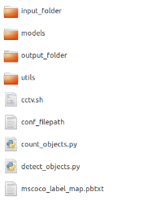

# Installation

This document aims to explain how to setup the cctv project in Ubuntu Server (v. 18.04 Bionic Beaver).

The installation comprises four main parts: 
* the installation of tensorflow-gpu
* the installation of tensorflow object detection API
* the creation of the directory of the project in the server
* the creation of a cron task.

## installation of tensorflow-gpu
Tensorflow supports CUDA 10.0. A more recent version of CUDA may not be supported.

### Removing CUDA Toolkit and Driver (if CUDA > 10.0)

This step may not be neccessary if one can install cuda 10.0 alongside more recent versions of cuda and make .bashrc file point to it. However to strictly follow tensorflow installation instructions it maybe better to previously uninstall cuda.

``` bash
# To remove CUDA Toolkit: 
sudo apt-get --purge remove "*cublas*" "cuda*"
# To remove NVIDIA Drivers: 
sudo apt-get --purge remove "\*nvidia\*"
sudo apt autoremove
```

Check usr/local/. Shouldn’t exist any cuda files or directories.

source: https://docs.nvidia.com/cuda/cuda-installation-guide-linux/index.html#removing-cuda-tk-and-driver

### Install cuda and nvidia drivers according  to tensorflow instructions

**Requires Python > 3.4 and pip >= 19.0**

``` bash
sudo apt update
sudo apt install python3-dev python3-pip
```
source: https://www.tensorflow.org/install/pip

Add NVIDIA package repositories (https://www.tensorflow.org/install/gpu)

Reboot the machine and check that  cuda is installled with  *nvidia-smi*.

**Note**: Dont’t install “virtualenv” but work with installed “venv”: https://realpython.com/python-virtual-environments-a-primer/

Finally:
``` bash
pip3 install virtualenvwrapper
```

### Update bash configuration file (*$HOME/.bashrc*)

Append the following lines to the .bashrc file:
``` bash
# NVIDIA CUDA Toolkit
export PATH=/usr/local/cuda-10.0/bin:$PATH
export LD_LIBRARY_PATH=/usr/local/cuda-10.0/lib64
export LD_LIBRARY_PATH=/usr/local/cuda/extras/CUPTI/lib64:$LD_LIBRARY_PATH

#virtualenvwrapper
export WORKON_HOME=$HOME/python-virtual-environments
export VIRTUALENVWRAPPER_PYTHON=/usr/bin/python3
source /home/username/.local/bin/virtualenvwrapper.sh
```
then rerun configuration file: *$source .bashrc*

### Install BLAS library

``` bash
sudo apt-get install build-essential cmake git unzip pkg-config libopenblas-dev liblapack-dev
```

### Install graphviz and pydot-ng

``` bash
sudo apt-get install graphviz
sudo pip3 install pydot-ng
```

### Installation of the remaining sw in the virtual environment of the project

``` bash
# create python virtual environment
$ mkvirtualenv cctv
```

In the cctv virtual env:

``` bash
pip install --upgrade pip
pip install pandas numpy scipy matplotlib seaborn pyyaml
pip install tensorflow-gpu==1.14 # older release 1.14
```

**Note**: When updating and upgrading repositories, cuda 10.1 (or a more recent version of CUDA) will be installed alonsigde cuda 10.0. However, cuda 10.0 will still be used by tensorflow because of the .basrc configuration. You can see that by running the command “nvcc -V” rather than “nvidia-smi”. Check nvidia website for more information.

## Tensorflow Object Detection API

Official instructions at: https://github.com/tensorflow/models/blob/master/research/object_detection/g3doc/installation.md

At #HOME, mkdir “tensorflow”

Within tensorflow directory, git clone models: 

``` bash
git clone https://github.com/tensorflow/models
```

### pip install packages in the python virtual environment of the project (" workon cctv")

``` bash
pip install Cython
pip install contextlib2
pip install pillow
pip install lxml
pip install jupyter
pip install matplotlib
```

### Install COCO API

At #HOME,

``` bash
git clone https://github.com/cocodataset/cocoapi.git
cd cocoapi/PythonAPI
make
cp -r pycocotools tensorflow/models/research/
```

After this operation, we can remove directory cocoapi from #HOME

### Protobuf Installation/Compilation

``` bash
# From tensorflow/models/research/
wget -O protobuf.zip https://github.com/google/protobuf/releases/download/v3.0.0/protoc-3.0.0-linux-x86_64.zip
unzip protobuf.zip
# From tensorflow/models/research/
./bin/protoc object_detection/protos/*.proto –python_out=.
```
This  operation compiles all the protobuf files and creates a name_pb2.py file from every name.proto file in the object_detection/protos folder.

### Add Libraries to PYTHONPATH in #HOME/.bashrc

``` bash
# Tensorflow object detection API - cctv
export PYTHONPATH=$PYTHONPATH:/home/username/tensorflow/models/research
export PYTHONPATH=$PYTHONPATH:/home/username/tensorflow/models/research/object_detection
export PYTHONPATH=$PYTHONPATH:/home/username/tensorflow/models/research/slim
```

### Finalize installation

``` bash
# From within TensorFlow/models/research/
python setup.py build
python setup.py install
```

### Testing the API (within virtual environment)

``` bash
python object_detection/builders/model_builder_test.py
```

## Create directory of the project in the server

For this, copy the “CCTV” directory created by UBDC, to the $HOME folder of the server.

The CCTV directory tree looks like the following image:

<p align="center">
  
</p>

The images of the CCTV cameras are copied into the input folder; the bash file makes the processing.
The folder “models” contains a collection of detection models pre-trained on the COCO dataset and available in:
https://github.com/tensorflow/models/blob/b968a6ce96789e1ffc2100b522a3bfaea45f26be/research/object_detection/g3doc/detection_model_zoo.md
The folder “utils” was also copied from research folder as also the coco pbtxt file.

### Test the script *detect_objects.py* in the virtual env

``` bash
python detect_objects.py conf_filepat
```

If ok, proceed. The *conf_filepath* is a configuration file with the model to use.

**Note**: The cctv bash file must be adapted for the specific server in use

## Create a cron task, with ”crontab -e” command

The cron app is a daemon to execute scheduled commands.
 The cron task is going to edit the cron file for the user.

The cron file has to ne edited with the following lines:

``` bash
# The same as $env
SHELL=/bin/bash
PATH=/usr/local/cuda-10.0/bin:/home/username/.local/bin:/home/username/bin:/usr/local/sbin:/usr/local/bin:/usr/sbin:/usr/bin:/sbin:/bin:/usr/games:/usr/local/games:/snap/bin:/home/username/bin
PYTHONPATH=:/home/username/tensorflow/models/research:/home/username/tensorflow/models/research/object_detection:/home/username/tensorflow/models/research/slim

# run cctv.sh every 15min
0,15,30,45 * * * * bash /home/username/CCTV/cctv.sh
```

After all these operations, the project must be able to process the images that are stored in the input_folder every 15 min. The configuration of the cctv cameras to go to home position, to take a snapshot and to store the images in the input_folder, aren't covered by this tutorial.
